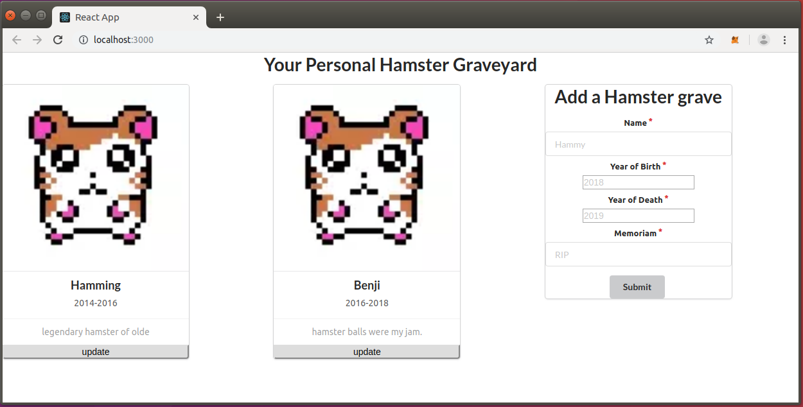

# Hamster Graveyard - ConsenSys Academy 2019 Final Project 

Hamster Graveyard is smart contract for memorializing your deceased hamsters.  It was primarily written as the final project for the ConsenSys Academy developer program, but was inspired by the oncoming mortality of my first pet hamster, Hamtaro.

This project is based on the truffle react box: https://github.com/truffle-box/react-box.git and imports libraries from OpenZeppelin: 
https://github.com/OpenZeppelin/openzeppelin-contracts.

For a video introduction, please visit https://www.youtube.com/watch?v=7Ls2rc9W63s.

Thanks for checking out my project!




## Setup

1. You will need to install nodejs.  Please see https://github.com/nodesource/distributions/blob/master/README.md for installation    directions.  This project was created with version `node v8.10.0`.

2. You will also need to install truffle, ganache-cli, and the truffle-hdwallet-provider.

   ```js
    npm install -g ganache-cli
    npm install -g truffle
    npm install -g truffle-hdwallet-provider
   ```
3. Clone this repo.

   ```js
    git clone https://github.com/soth02/HamsterGraveyard.git
   ```
4. Navigate to the `client` directory and run `npm install`.
   
   ```js
   cd HamsterGraveyard/client
   npm install
   ```
   
5. Run the development console.
    ```javascript
    truffle develop
    ```
    * Write down seed phrase that is generated by ganache.
    
6. Compile and migrate the smart contracts. Note inside the development console we don't preface commands with `truffle`.
    ```javascript
    compile
    migrate
    ```
7. Run tests against the solidity contracts.

    ```javascript
    test
    ```

8. Open another terminal.  Navigate to the `client` directory, run the React app. Smart contract changes must be manually recompiled and migrated.
    ```javascript
    // open another terminal (i.e. not in the truffle develop prompt)
    cd client
    npm run start
    ```
9. Install MetaMask on your browser: https://metamask.io.
   * Import seed phrase copied down earlier from ganache chain.
   * Change network to Localhost 8545.
   * If you have been using MetaMask on Ganache previously, you may need to reset your account
     in Settings->Advanced->Reset Account to synchronize with the ganache chain.

10. Navigate to React server at http://localhost:3000
      * Accept React App prompt.

11. Start adding Hamster Memorials!
